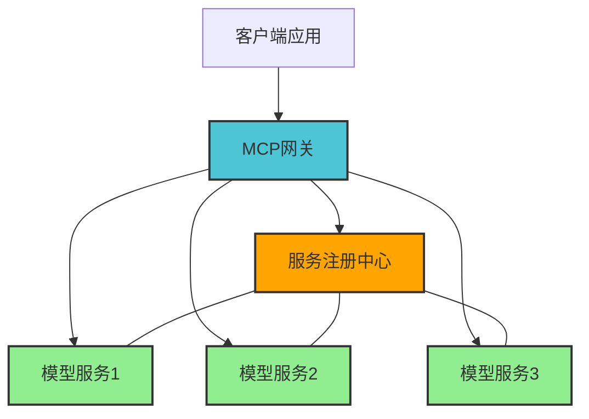

# MCP入门

<div class="text-xl mt-2 opacity-75">快速了解和掌握MCP</div>

<div class="mt-12 flex justify-center">
  <div class="px-4 py-2 rounded cursor-pointer bg-blue-500 hover:bg-blue-600 text-white" @click="$slidev.nav.next">
    开始探索 <carbon:arrow-right class="inline ml-1" />
  </div>
</div>

<!--
欢迎来到MCP入门课程，本次演讲将帮助大家快速了解和掌握MCP的核心概念和使用方法。
-->

---
layout: center
class: text-center
---

# 目录

<TwoColumns>
  <template #left>
    <CardBox title="基础概念" icon="carbon:idea" color="blue" animate>
      <template #content>
        <ul class="ml-4 list-disc">
          <li>什么是MCP</li>
          <li>MCP核心功能</li>
          <li>MCP架构</li>
        </ul>
      </template>
    </CardBox>
  </template>
  <template #right>
    <CardBox title="实践应用" icon="carbon:application" color="green" animate>
      <template #content>
        <ul class="ml-4 list-disc">
          <li>MCP使用场景</li>
          <li>MCP基本使用方法</li>
          <li>MCP最佳实践</li>
        </ul>
      </template>
    </CardBox>
  </template>
</TwoColumns>

<!--
本次演讲将分为两大部分：基础概念和实践应用。
在基础概念部分，我们将了解MCP的定义、核心功能和架构设计。
在实践应用部分，我们将探讨MCP的使用场景、基本使用方法以及最佳实践。
-->

---
---

# 什么是MCP

<CardBox title="MCP概述" icon="carbon:cloud-service-management" color="blue">
  <template #content>
    <div class="flex items-center justify-between">
      <ul class="ml-4 list-disc">
        <li>MCP是<span class="text-blue-500 font-bold">Model Control Protocol</span>的缩写</li>
        <li>一种用于AI模型交互的标准化协议</li>
        <li>提供统一的接口和服务管理</li>
        <li>支持多种AI模型和服务集成</li>
      </ul>
      <div class="text-6xl text-blue-500 opacity-80">
        <carbon:cloud-service-management />
      </div>
    </div>
  </template>
</CardBox>

<!--
MCP代表Model Control Protocol，是一种专为AI模型交互设计的标准化协议。
它提供了统一的接口和服务管理机制，使开发者能够更容易地集成和控制各种AI模型。
MCP的核心价值在于简化了AI服务的接入和管理流程，提高了开发效率。
-->

---
---

# MCP核心功能

<TwoColumns>
  <template #left>
    <CardBox title="基础能力" icon="carbon:function" color="green" animate>
      <template #content>
        <ul class="ml-4 list-disc">
          <li>模型服务注册与发现</li>
          <li>统一的API接口</li>
          <li>服务状态监控</li>
        </ul>
      </template>
    </CardBox>
  </template>
  <template #right>
    <CardBox title="高级特性" icon="carbon:chart-radar" color="purple" animate>
      <template #content>
        <ul class="ml-4 list-disc">
          <li>多模型协同工作</li>
          <li>自动化服务编排</li>
          <li>性能优化与负载均衡</li>
        </ul>
      </template>
    </CardBox>
  </template>
</TwoColumns>

<!--
MCP提供了丰富的核心功能，可以分为基础能力和高级特性两类。

基础能力包括：
- 模型服务注册与发现：自动识别和管理可用的AI模型服务
- 统一的API接口：提供标准化的接口，简化开发流程
- 服务状态监控：实时监控服务运行状态和健康度

高级特性包括：
- 多模型协同工作：支持多个AI模型协同完成复杂任务
- 自动化服务编排：根据任务需求自动组织和调度服务
- 性能优化与负载均衡：智能分配资源，提高系统整体性能
-->

---
---

# MCP架构

<div class="flex justify-center">

</div>

<!--
MCP采用了分层架构设计，主要包括以下几个核心组件：

1. 客户端应用：用户的应用程序，通过MCP接口调用AI服务
2. MCP网关：核心组件，负责请求路由、负载均衡和服务协调
3. 服务注册中心：管理所有可用的模型服务，提供服务发现功能
4. 模型服务：各种AI模型的具体实现，如语言模型、图像识别模型等

这种架构设计使MCP具有高度的可扩展性和灵活性，能够适应各种复杂的AI应用场景。
-->

---
---

# MCP使用场景

<div class="grid grid-cols-3 gap-4">
  <CardBox title="智能客服" icon="carbon:chat" color="blue" animate>
    <template #content>
      <div class="text-center mb-2">
        <carbon:chat class="text-3xl text-blue-500" />
      </div>
      <div class="text-sm">整合多个模型提供全面客服解决方案</div>
    </template>
  </CardBox>
  
  <CardBox title="内容创作" icon="carbon:pen" color="green" animate>
    <template #content>
      <div class="text-center mb-2">
        <carbon:pen class="text-3xl text-green-500" />
      </div>
      <div class="text-sm">协调文本和图像模型进行创意内容生成</div>
    </template>
  </CardBox>
  
  <CardBox title="数据分析" icon="carbon:chart-line" color="purple" animate>
    <template #content>
      <div class="text-center mb-2">
        <carbon:chart-line class="text-3xl text-purple-500" />
      </div>
      <div class="text-sm">结合多种分析模型提供深度数据洞察</div>
    </template>
  </CardBox>
</div>

<!--
MCP适用于多种业务场景，特别是那些需要多个AI模型协同工作的复杂应用：

1. 智能客服：
   - 整合NLP模型处理文本查询
   - 结合知识图谱提供准确回答
   - 情感分析模型评估客户情绪
   - 自动升级复杂问题到人工客服

2. 内容创作：
   - 文本生成模型创建初始内容
   - 图像生成模型提供配图
   - 内容审核模型确保合规性
   - 风格调整模型优化表达方式

3. 数据分析：
   - 预测模型分析趋势
   - 异常检测模型识别问题
   - 分类模型对数据进行分组
   - 可视化模型生成直观报表
-->

---
---

# MCP基本使用方法

<CardBox title="快速入门" icon="carbon:code" color="blue">
  <template #content>
    <div class="code-container">
      <div class="code-title">JavaScript 示例代码</div>
    </div>
  </template>
</CardBox>

```js
// 1. 引入MCP客户端
import { MCPClient } from 'mcp-client';

// 2. 初始化客户端
const client = new MCPClient({
  endpoint: 'https://mcp-api.example.com',
  apiKey: 'your_api_key'
});

// 3. 调用服务
async function generateResponse(input) {
  const result = await client.invoke('text-generation', {
    prompt: input,
    max_tokens: 100
  });
  return result.output;
}
```

<!--
MCP的基本使用流程非常简单，主要包括以下几个步骤：

1. 引入MCP客户端：根据你的开发环境选择合适的客户端库
2. 初始化客户端：配置API端点和认证信息
3. 调用服务：使用client.invoke方法调用所需的AI模型服务

代码示例展示了一个基本的文本生成服务调用。在实际应用中，你可以根据需要调用不同类型的服务，如图像生成、语音识别等。

MCP客户端会自动处理服务发现、负载均衡和错误重试等底层细节，让开发者可以专注于业务逻辑的实现。
-->

---
---

# MCP最佳实践

<TwoColumns>
  <template #left>
    <CardBox title="性能优化" icon="carbon:optimize" color="blue" animate>
      <template #content>
        <ul class="ml-4 list-disc">
          <li>批量处理请求</li>
          <li>合理设置超时时间</li>
          <li>使用缓存减少重复调用</li>
        </ul>
      </template>
    </CardBox>
    <CardBox title="错误处理" icon="carbon:warning" color="red" animate>
      <template #content>
        <ul class="ml-4 list-disc">
          <li>实现优雅的降级策略</li>
          <li>添加重试机制</li>
          <li>详细的日志记录</li>
        </ul>
      </template>
    </CardBox>
  </template>
  
  <template #right>
    <CardBox title="安全建议" icon="carbon:security" color="green" animate>
      <template #content>
        <ul class="ml-4 list-disc">
          <li>定期轮换API密钥</li>
          <li>实施最小权限原则</li>
          <li>加密敏感数据</li>
        </ul>
      </template>
    </CardBox>
    <CardBox title="监控与告警" icon="carbon:dashboard" color="purple" animate>
      <template #content>
        <ul class="ml-4 list-disc">
          <li>设置关键指标监控</li>
          <li>配置异常告警</li>
          <li>定期审查使用情况</li>
        </ul>
      </template>
    </CardBox>
  </template>
</TwoColumns>

<!--
为了充分发挥MCP的潜力，建议遵循以下最佳实践：

性能优化：
- 批量处理请求：将多个小请求合并为一个批量请求，减少网络开销
- 合理设置超时时间：根据模型复杂度和任务要求设置适当的超时时间
- 使用缓存减少重复调用：对于相同或相似的请求，利用缓存机制避免重复计算

错误处理：
- 实现优雅的降级策略：当首选模型不可用时，自动切换到备用模型
- 添加重试机制：对于暂时性错误，实现智能重试策略
- 详细的日志记录：记录关键操作和错误信息，便于问题排查

安全建议：
- 定期轮换API密钥：降低密钥泄露的风险
- 实施最小权限原则：只授予应用所需的最小权限
- 加密敏感数据：确保传输和存储的数据安全

监控与告警：
- 设置关键指标监控：如响应时间、错误率、并发请求数等
- 配置异常告警：当指标超出阈值时及时通知相关人员
- 定期审查使用情况：分析使用模式，优化资源分配
-->

---
layout: center
class: text-center
---

# 总结

<div class="flex justify-center">
  <CardBox title="MCP核心要点" icon="carbon:summary" color="blue" animate>
    <template #content>
      <ul class="ml-4 list-disc text-left">
        <li>MCP提供统一的AI模型服务接口</li>
        <li>支持多模型协同工作和自动服务编排</li>
        <li>适用于智能客服、内容创作等多种场景</li>
        <li>使用简单，只需几行代码即可接入</li>
        <li>遵循最佳实践可显著提升应用质量</li>
      </ul>
    </template>
  </CardBox>
</div>

<div class="mt-8 text-center">
  <div class="text-xl font-bold text-blue-500">感谢观看！</div>
  <div class="mt-2">欢迎提问</div>
</div>

<!--
通过本次演讲，我们了解了MCP的核心概念、功能特性、架构设计、应用场景和使用方法。

MCP作为一种强大的AI模型控制协议，能够帮助开发者更高效地集成和管理各种AI服务，简化开发流程，提升应用质量。

无论是构建智能客服系统、内容创作平台还是数据分析工具，MCP都能提供强大的支持，帮助你快速实现AI赋能的业务场景。

希望本次分享对大家有所帮助，如有任何问题，欢迎随时提问。
-->
